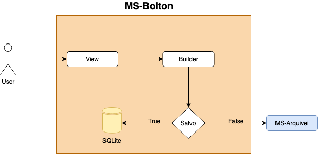

# Bolton_arquivei

### Descrição
Desafio da Arquivei, este projeto faz integração com o serviço de notas da Arquivei.



### File tree
```
    .
    ├── src                    
      ├── builders             # Process the data for the format of service. 
      ├── models               # DB models
      ├── queries              # DB queries
      ├── tests                # Tests for all application
      ├── integrations         # All externals integrations
      └── views                # Process requisitions
    ├── migrations          # Migrations maded with DB
    ├── app                 # Service app
    ├── config              # Variables of ambient
    └── run                 # Start service
```

### Build Application
To build application make this steps:

```bash
    pip install -r requirements.txt
    flask init
    flask migrate
    flask upgrade
    python run.py
```


### Routes

### **POST** /invoice
- Retorna a nota fiscal de acordo com o access key.

>:white_check_mark: **_Retorno com sucesso_**

>**HTTP Status** `200`
```
{
    "xml_value": "xml_file"
}
```


>:x: **_Retorno Parametro invalido_**

>**HTTP Status** `400`

**Response**
```
{ "message": "param access_key not sent" }
```

>:x: **_Retorno Não encontrado_**

>**HTTP Status** `404`

**Response**
```
{ "message": "invoice not found" }
```

>:x: **_Retorno Erro_**

>**HTTP Status** `500`

**Response**
```
{ "message": "internal error" }
```
